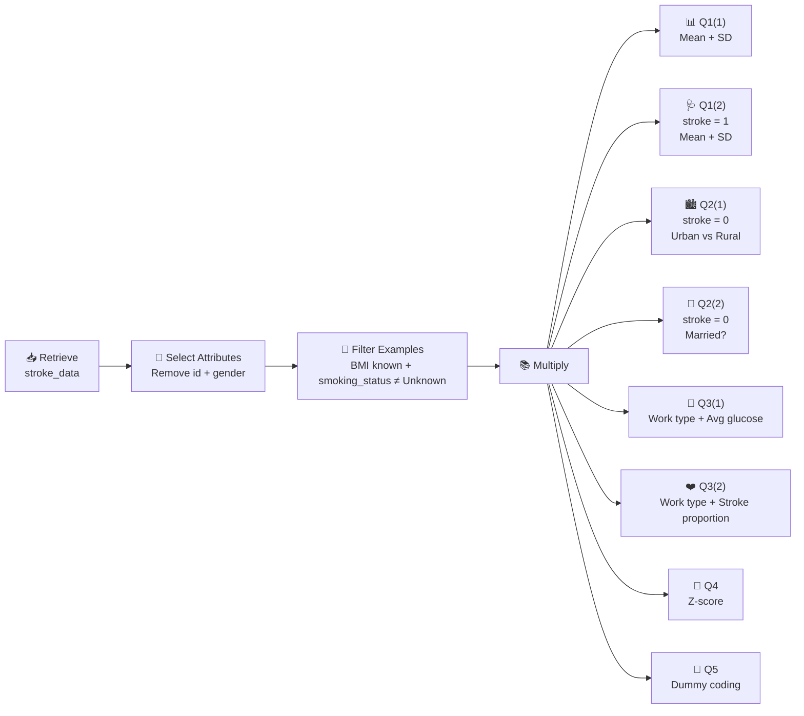
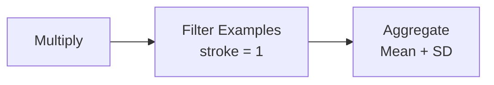
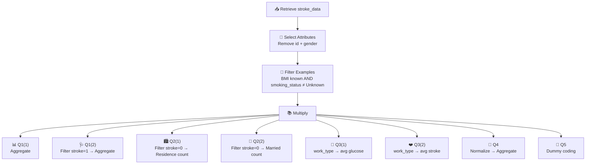

<div align="center">

# 🧠📊 Homework 1 - RapidMiner / Altair AI Studio
### **Data Mining for Business Analytics — Visual & Guided Edition**

**Course:** MBA/GBUS 738  
**Dataset:** `stroke_data.csv`  
**Required process:** `HW1.rmp`  
**Written submission:** `HW1.docx` or `HW1.pdf`

---

### 🎯 Mission
> **Clean once → Multiply → Solve Q1–Q5 → Validate → Submit**
> > Prepared by [arharif](https://arharif.github.io/)

</div>

---

## 🌟 0. Big Picture



> 💡 **Memory trick:**  
> `Select Attributes = columns`  
> `Filter Examples = rows`  
> `Aggregate = summarize`  
> `Multiply = reuse the same clean dataset`

---

# 🧩 1. Understand the Dataset

The homework states that the original file contains **5,110 observations and 12 attributes**.

| RapidMiner term | Simple meaning |
|---|---|
| **Example** | One patient / one row |
| **Attribute** | One variable / one column |
| **ExampleSet** | The full table |
| **Retrieve** | Load data |
| **Select Attributes** | Keep/remove columns |
| **Filter Examples** | Keep/remove rows |
| **Aggregate** | Calculate grouped statistics |
| **Normalize** | Rescale numerical data |
| **Nominal to Numerical** | Convert categories to numbers |
| **res** | Result output |

---

# 🚀 2. Build the Base Process

## ✅ Step 1 — Import `stroke_data.csv`

### Click path

```text
Altair AI Studio
   ↓
Import Data
   ↓
Select stroke_data.csv
   ↓
Finish Import
   ↓
Save as: stroke_data
```

Drag `stroke_data` into the **Design** canvas.

You should see:

```text
📥 Retrieve stroke_data
```

### What this does

It simply loads the dataset. No rows or columns are modified yet.

---

## ✅ Step 2 — Remove `id` and `gender`

Search for:

```text
Select Attributes
```

Drag it after `Retrieve`.

### Connect

```text
Retrieve stroke_data
        ↓
Select Attributes
```

### Configure

```text
attribute filter type = subset
attributes = id, gender
invert selection = true
```

### Why `invert selection = true`?

Because we selected:

```text
id
gender
```

but we want RapidMiner to understand:

> ❌ remove these two  
> ✅ keep everything else

### Visual check

Before:

| id | gender | age | bmi | stroke |
|---:|---|---:|---:|---:|
| 9046 | Male | 67 | 36.6 | 1 |

After:

| age | bmi | stroke |
|---:|---:|---:|
| 67 | 36.6 | 1 |

---

## ✅ Step 3 — Remove invalid records

Search for:

```text
Filter Examples
```

Connect:

```text
Retrieve
   ↓
Select Attributes
   ↓
Filter Examples
```

### Required logic

Keep only rows where:

```text
bmi is not missing
AND
smoking_status != Unknown
```

### Why AND?

| BMI valid? | Smoking status valid? | Keep? |
|---|---|---|
| ✅ | ✅ | ✅ YES |
| ❌ | ✅ | ❌ NO |
| ✅ | ❌ | ❌ NO |
| ❌ | ❌ | ❌ NO |

> 🧠 **Rule:** Both conditions must be valid.

---

## 🔍 Checkpoint #1 — Validate the Clean Dataset

Temporarily connect:

```text
Filter Examples → res
```

Run ▶️

Check:

```text
✅ id is gone
✅ gender is gone
✅ bmi has no missing values
✅ smoking_status has no Unknown
```

If all four are true, your cleaning stage is correct.

---

# 🪄 3. Add `Multiply`

Search:

```text
Multiply
```

Connect:

```text
Retrieve
   ↓
Select Attributes
   ↓
Filter Examples
   ↓
Multiply
```

### Think of `Multiply` like a photocopier

```text
                  ┌─ Q1(1)
                  ├─ Q1(2)
                  ├─ Q2(1)
Clean dataset ────┼─ Q2(2)
                  ├─ Q3(1)
                  ├─ Q3(2)
                  ├─ Q4
                  └─ Q5
```

---

# 📊 4. Question 1 — Mean & Standard Deviation

---

## 🟦 Q1(1) — Entire Filtered Sample

Use the first output of `Multiply`.

Add:

```text
Aggregate
```

Rename:

```text
Aggregate_Q1_1
```

### Do NOT use `group by`

Add these six calculations:

```text
avg_glucose_level → average
avg_glucose_level → standard_deviation

age → average
age → standard_deviation

bmi → average
bmi → standard_deviation
```

### Why?

We want one summary row for **all cleaned patients**.

### Formula refresher

\[
\bar{x} = \frac{\sum x_i}{n}
\]

Standard deviation tells us how spread out the values are around the mean.

### Result template

| Attribute | Mean | Standard Deviation |
|---|---:|---:|
| avg_glucose_level | `[result]` | `[result]` |
| age | `[result]` | `[result]` |
| bmi | `[result]` | `[result]` |

---

## 🟥 Q1(2) — Only Patients With Stroke

Use the second output of `Multiply`.

Add:

```text
Filter Examples
```

Configure:

```text
stroke = 1
```

Then add:

```text
Aggregate
```

Configure exactly the same six statistics as Q1(1).

### Flow



### Final Q1 table

| Attribute | Entire Sample Mean | Entire Sample SD | Stroke=1 Mean | Stroke=1 SD |
|---|---:|---:|---:|---:|
| avg_glucose_level | `[ ]` | `[ ]` | `[ ]` | `[ ]` |
| age | `[ ]` | `[ ]` | `[ ]` | `[ ]` |
| bmi | `[ ]` | `[ ]` | `[ ]` | `[ ]` |

---

# 🏙️ 5. Question 2 — Patients With `stroke = 0`

---

## 🟩 Q2(1) — Urban or Rural?

Use another `Multiply` output.

Add:

```text
Filter Examples
stroke = 0
```

Then:

```text
Aggregate
```

Configure:

```text
group by = Residence_type
age → count
```

### What RapidMiner is doing

```text
1. Keep only non-stroke patients
2. Split them into Urban and Rural
3. Count each group
```

### Result template

| Residence_type | Count |
|---|---:|
| Rural | `[ ]` |
| Urban | `[ ]` |

### Write-up

> Among patients who did not have a stroke, there were more patients living in **[Urban/Rural]** areas.

---

## 💍 Q2(2) — Are There More Married Patients?

Use another `Multiply` output.

Filter:

```text
stroke = 0
```

Then aggregate:

```text
group by = ever_married
age → count
```

### Result template

| ever_married | Count |
|---|---:|
| No | `[ ]` |
| Yes | `[ ]` |

### Write-up

> **[Yes/No]**, there were more **[married/non-married]** patients among patients who did not have a stroke.

---

# 💼 6. Question 3 — `work_type`

---

## 🟨 Q3(1) — Which Work Type Has Highest Average Glucose?

Use another `Multiply` output.

Add:

```text
Aggregate
```

Configure:

```text
group by = work_type
avg_glucose_level → average
```

### RapidMiner logic

```text
Private ───────────────→ average glucose
Self-employed ─────────→ average glucose
Govt_job ──────────────→ average glucose
children ──────────────→ average glucose
Never_worked ──────────→ average glucose
```

Pick the **largest average**.

### Write-up

> The work type with the highest average `avg_glucose_level` is **[work type]**, with an average of **[value]**.

---

## ❤️ Q3(2) — Which Work Type Has Highest Stroke Proportion?

Use another `Multiply` output.

Add:

```text
Aggregate
```

Configure:

```text
group by = work_type
stroke → average
```

### Why does `average(stroke)` give a proportion?

Because:

```text
stroke = 0 → no stroke
stroke = 1 → stroke
```

Example:

```text
0, 0, 1, 0, 1
```

\[
\frac{0+0+1+0+1}{5}=0.40
\]

Therefore:

```text
0.40 = 40%
```

### Conversion

\[
\text{Percentage} = \text{average(stroke)} \times 100
\]

### Write-up

> The work type with the highest stroke proportion is **[work type]**, with a proportion of **[value]**, equivalent to **[percentage]%**.

---

# 📏 7. Question 4 — Z-Score Normalization

Use another `Multiply` output.

Add:

```text
Normalize
```

Select only:

```text
bmi
avg_glucose_level
```

Choose:

```text
Z-transformation
```

### Formula

\[
z = \frac{x-\mu}{\sigma}
\]

### Meaning

```text
z = 0   → exactly around average
z = +1  → one standard deviation above average
z = -1  → one standard deviation below average
```

After Z-score normalization:

```text
Mean ≈ 0
SD ≈ 1
```

### Add `Aggregate` after Normalize

Configure:

```text
bmi → average
bmi → standard_deviation

avg_glucose_level → average
avg_glucose_level → standard_deviation
```

### Result template

| Normalized Attribute | Mean | Standard Deviation |
|---|---:|---:|
| bmi | `[ ]` | `[ ]` |
| avg_glucose_level | `[ ]` | `[ ]` |

> ⚠️ A result like `2.1E-16` is essentially zero. It is a floating-point rounding effect.

---

# 🔢 8. Question 5 — Dummy Coding

Use the final `Multiply` branch.

Add:

```text
Nominal to Numerical
```

Select:

```text
ever_married
Residence_type
smoking_status
```

Choose:

```text
coding type = dummy coding
```

### Example

```text
Residence_type
Urban
Rural
```

can become conceptually:

```text
Residence_type_Urban

Urban → 1
Rural → 0
```

### Why?

Machine-learning algorithms usually require numbers.

Dummy coding creates meaningful 0/1 indicators without pretending categories have a numerical ranking.

> ✅ No written numerical answer is required for Q5.  
> ⚠️ The operator must still appear in your `HW1.rmp`.

---

# 🗺️ 9. Final Process Map



---

# 🏷️ 10. Recommended Operator Names

```text
Retrieve_stroke_data
Select_Attributes
Filter_Clean_Data
Multiply

Aggregate_Q1_1
Filter_Q1_Stroke1
Aggregate_Q1_2

Filter_Q2_Residence
Aggregate_Q2_1

Filter_Q2_Married
Aggregate_Q2_2

Aggregate_Q3_1
Aggregate_Q3_2

Normalize_Q4
Aggregate_Q4

DummyCoding_Q5
```

---

# 🧪 11. RapidMiner Debugging Guide

<details>
<summary><strong>❌ My results look wrong after filtering</strong></summary>

Check that you used:

```text
bmi is not missing
AND
smoking_status != Unknown
```

not OR.

</details>

<details>
<summary><strong>❌ Only id and gender remain</strong></summary>

You probably forgot:

```text
invert selection = true
```

inside `Select Attributes`.

</details>

<details>
<summary><strong>❌ Q3(2) gives counts instead of proportions</strong></summary>

Use:

```text
stroke → average
```

not:

```text
stroke → count
```

</details>

<details>
<summary><strong>❌ Q4 mean is not exactly 0</strong></summary>

A number such as:

```text
-1.7E-16
```

is essentially zero due to floating-point arithmetic.

</details>

---

# 📝 12. Final Answer Template

## Question 1

### Q1(1)

| Attribute | Mean | Standard Deviation |
|---|---:|---:|
| avg_glucose_level | `[ ]` | `[ ]` |
| age | `[ ]` | `[ ]` |
| bmi | `[ ]` | `[ ]` |

### Q1(2)

| Attribute | Mean | Standard Deviation |
|---|---:|---:|
| avg_glucose_level | `[ ]` | `[ ]` |
| age | `[ ]` | `[ ]` |
| bmi | `[ ]` | `[ ]` |

---

## Question 2

### Q2(1)

```text
Urban = [ ]
Rural = [ ]
```

> More patients lived in **[Urban/Rural]** areas.

### Q2(2)

```text
Married = Yes: [ ]
Married = No: [ ]
```

> **[Yes/No]**, there were more **[married/non-married]** patients.

---

## Question 3

### Q3(1)

> **[work type]** has the highest average glucose level: **[value]**.

### Q3(2)

> **[work type]** has the highest stroke proportion: **[value] = [percentage]%**.

---

## Question 4

| Attribute | Mean After Z-Score | SD After Z-Score |
|---|---:|---:|
| bmi | `[ ]` | `[ ]` |
| avg_glucose_level | `[ ]` | `[ ]` |

---

## Question 5

```text
Dummy coding included for:
✓ ever_married
✓ Residence_type
✓ smoking_status
```

---

# ✅ 13. Submission QA Dashboard

| Check | Status |
|---|---|
| `id` removed | ⬜ |
| `gender` removed | ⬜ |
| Missing `bmi` removed | ⬜ |
| `Unknown` smoking status removed | ⬜ |
| `Multiply` used | ⬜ |
| Q1 complete | ⬜ |
| Q2 complete | ⬜ |
| Q3 complete | ⬜ |
| Q4 complete | ⬜ |
| Q5 included | ⬜ |
| Saved as `HW1.rmp` | ⬜ |
| Written file saved as `HW1.docx` or `HW1.pdf` | ⬜ |
| Files opened and verified before submission | ⬜ |

---

<div align="center">

# 🏁 Final Memory Map

```text
📥 LOAD
   ↓
🧹 CLEAN COLUMNS
   ↓
🧼 CLEAN ROWS
   ↓
📚 MULTIPLY
   ↓
📊 ANALYZE
   ↓
📏 NORMALIZE
   ↓
🔢 ENCODE
   ↓
✅ VERIFY
   ↓
📤 SUBMIT
```

### **Clean once. Analyze consistently. Verify before submission.**

</div>
